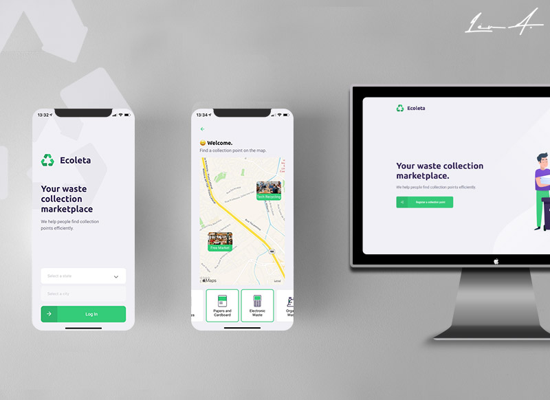

<p align="center">

</p>

<h1 align="center">A technological and effective method for waste collection</h1>

<blockquote align="center">
♻️ A full stack application developed at Next Level Week promoted by <a href="http://github.com/rocketseat">Rocketseat</a>
</blockquote>

<p align="center">
  

  <a href="https://leunardo.dev">
    
  </a>
</p>

<!-- p align="center">

</p -->

## Introduction

[Ecollection](https://github.com/LeuAlmeida/ecollection) is a fictitious company and this repository belong to the business logic and is the basis of a general structure.

## :electric_plug: Prerequisites

- [Node.js LTS (>= 12.x)](https://nodejs.org/)
- [Yarn (>= 1.21)](https://yarnpkg.com/) or [NPM (>= 6.9)](https://www.npmjs.com/)

## :closed_lock_with_key: API Instructions

First get all the requirements installed on your system.

### Getting started the API Restful backend

Make a clone from the repo and install the dependencies

```shell

# After clone this repo, enter in the API folder
$ cd backend

# Install all dependencies using Yarn
$ yarn

# Run the migrations and seeds
$ yarn knex:migrate && yarn knex:seed
```

Start the project

```shell
# Run the development server
$ yarn dev

# Case the output appears like this, is all ok
yarn run v1.21.1
$ ts-node-dev src/server.ts

# The backend will run on port 3333
# https://localhost:3333
```

<!--
# :computer: Web Application instructions

Make a clone from the repo and install the dependencies. (Certify yourself that the api is running)

```shell
# After clone this repo, enter in the Web folder
$ cd web

# Install all dependencies using Yarn
$ yarn

# Run the project
$ yarn start
```
-->

<!--
# :iphone: Mobile App instructions (Has not been tested on iOS)

Make a clone from the repo and install the dependencies

```shell
# After clone this repo, enter in the DevRadar folder
$ cd fastfeet-app

# Install all dependencies using Yarn
$ yarn

# Run the react native metro bundle
$ react-native start

# Run the project
$ react-native run-android
```
-->

## :copyright: License

MIT License.

See [LICENSE](LICENSE) for details.

<hr/>

<h3 align="center">
<a href="http://linkedin.com/in/leonardoalmeida99">Connect me in LinkedIn</a> | <a href="http://behance.net/almeida99">See my Behance</a> | <a href="https://leunardo.dev">Click here to go to my CV</a>
</h3>
